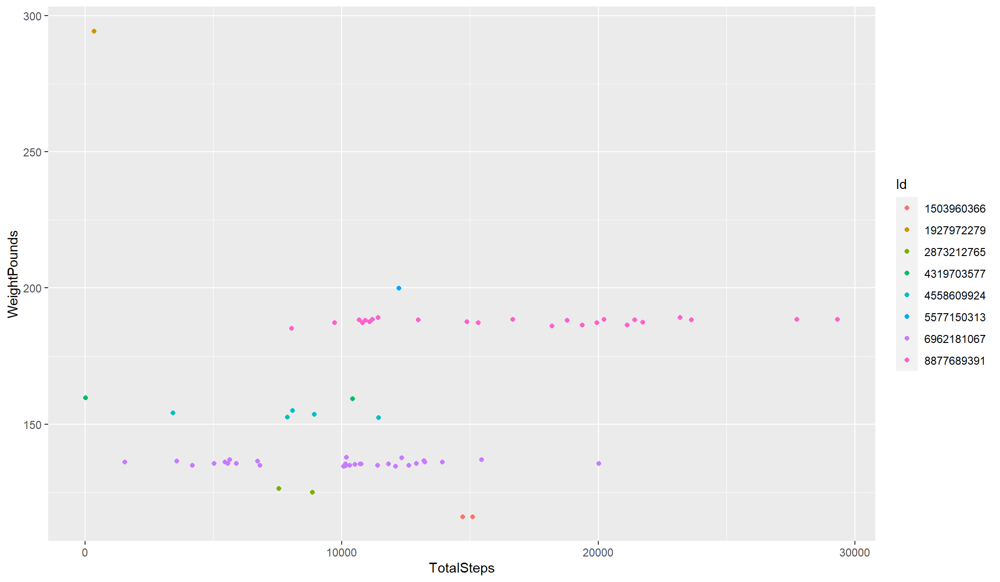

## Introduction

Bellabeat is a a high-tech manufacturer of health-focused products for women. These include the fitness trackers Time, a smartwatch, and Leaf, which can be worn as a bracelet, necklace, or clip, along with Spring, a water bottle that tracks daily water intake. These products sync with the Bellabeat app, which provides users with health data related to their activity, sleep, stress, menstrual cycle, and mindfulness habits. The company also offers a membership, which gives subscribers personalized recommendations on things such as nutrition, activity, and sleep based on a user's lifestyle and goals.

Founded in 2013, Bellabeat remains a small enterprise compared with its rivals, but it has grown into a global company, investing in advertising campaigns across Google, Facebook and Instagram. It also regularly engages with consumers through Twitter.

Bellabeat has the potential to grow into a bigger player in the smart devices market, and it hopes that available consumer data can reveal more opportunities for growth.

## The task

Analyze smart device usage data in order to gain insight into how people are already using their smart devices. Using this information, offer high-level recommendations for how these trends can inform Bellabeat marketing strategy.

This case study follows the six-step process identified by the Google Analytics Professional Certificate program:

1. [Ask](#ask)
2. [Prepare](#prepare)
3. [Process](#process)
4. [Analyze](#analyze)
5. [Share](#share)
6. [Act](#act)


## Ask

Guiding questions:

1. What are some trends in smart device usage?
2. How could these trends apply to Bellabeat customers?
3. How could these trends help influence Bellabeat marketing strategy?

Key stakeholders:
- **Urška Sršen:** Bellabeat cofounder and chief creative officer
- **Sando Mur:** Bellabeat cofounder and mathematician
- **Bellabeat marketing analytics team:** A team of data analysts responsible for collecting, analyzing, and reporting data that helps guide Bellabeat’s marketing strategy.

## Prepare

This analysis uses [Fitbit fitness tracker data](https://www.kaggle.com/datasets/arashnic/fitbit) made available by the user Möbius on Kaggle. It was collected via Amazon Mechanical Turk in 2016, between March 12 and May 12, from 30 Fitbit users who consented to submit their tracker data. The dataset was released under a [CC0: Public Domain](https://creativecommons.org/publicdomain/zero/1.0/) license.

### Dataset limitations:

- Möbius identifies only 30 participants, making the sample size relatively small, but it still meets the minimum size typically needed for the [central limit theorem](https://en.wikipedia.org/wiki/Central_limit_theorem) to hold.
  - However, not all 30 participants are included in all the datasets. While the activity dataset shows 33 unique users (`n_distinct(daily_activity$Id)`), the sleep data has 24 (`n_distinct(sleep_day$Id)`), and the weight data comes from just eight people (`n_distinct(weight_log$Id)`).
- At more than 5 years old, the dataset is no longer current. A lot can change in a market in five years, which could impact the efficacy of recommendations.
- While the data is well-cited and appears to come directly from Fitbit devices, some of the information is self-reported (such as weight), and there is no way to determine whether any of the data was tampered with before being submitted online.

### Tools

R and RStudio were used for this analysis.

### Packages

```r
install.packages('tidyverse')
install.packages('tidyr')
install.packages('dplyr')
install.packages('here')
install.packages('skimr')
install.packages('janitor')

library(tidyverse)
library(tidyr)
library(dplyr)
library(here)
library(skimr)
library(janitor)
```

### Datasets used

Three of the provided CSV files were used in this analysis.

```r
daily_activity <- read.csv("dailyActivity_merged.csv")
sleep_day <- read.csv("sleepDay_merged.csv")
weight_log <- read.csv("weightLogInfo_merged.csv")
```

Since the daily activity dataset contains the data for daily steps, intensities and calories, these CSV files do not need to be imported separately.

## Process

The head function was used to check the first few rows of each data frame and make sure they imported properly.

```r
> head(daily_activity)
          Id ActivityDate TotalSteps TotalDistance TrackerDistance
1 1503960366    4/12/2016      13162          8.50            8.50
2 1503960366    4/13/2016      10735          6.97            6.97
3 1503960366    4/14/2016      10460          6.74            6.74
4 1503960366    4/15/2016       9762          6.28            6.28
5 1503960366    4/16/2016      12669          8.16            8.16
6 1503960366    4/17/2016       9705          6.48            6.48
  LoggedActivitiesDistance VeryActiveDistance ModeratelyActiveDistance
1                        0               1.88                     0.55
2                        0               1.57                     0.69
3                        0               2.44                     0.40
4                        0               2.14                     1.26
5                        0               2.71                     0.41
6                        0               3.19                     0.78
  LightActiveDistance SedentaryActiveDistance VeryActiveMinutes
1                6.06                       0                25
2                4.71                       0                21
3                3.91                       0                30
4                2.83                       0                29
5                5.04                       0                36
6                2.51                       0                38
  FairlyActiveMinutes LightlyActiveMinutes SedentaryMinutes Calories
1                  13                  328              728     1985
2                  19                  217              776     1797
3                  11                  181             1218     1776
4                  34                  209              726     1745
5                  10                  221              773     1863
6                  20                  164              539     1728
```

```r
> head(sleep_day)
          Id              SleepDay TotalSleepRecords TotalMinutesAsleep
1 1503960366 4/12/2016 12:00:00 AM                 1                327
2 1503960366 4/13/2016 12:00:00 AM                 2                384
3 1503960366 4/15/2016 12:00:00 AM                 1                412
4 1503960366 4/16/2016 12:00:00 AM                 2                340
5 1503960366 4/17/2016 12:00:00 AM                 1                700
6 1503960366 4/19/2016 12:00:00 AM                 1                304
  TotalTimeInBed
1            346
2            407
3            442
4            367
5            712
6            320
```

```r
> head(weight_log)
          Id                  Date WeightKg WeightPounds Fat   BMI
1 1503960366  5/2/2016 11:59:59 PM     52.6     115.9631  22 22.65
2 1503960366  5/3/2016 11:59:59 PM     52.6     115.9631  NA 22.65
3 1927972279  4/13/2016 1:08:52 AM    133.5     294.3171  NA 47.54
4 2873212765 4/21/2016 11:59:59 PM     56.7     125.0021  NA 21.45
5 2873212765 5/12/2016 11:59:59 PM     57.3     126.3249  NA 21.69
6 4319703577 4/17/2016 11:59:59 PM     72.4     159.6147  25 27.45
  IsManualReport        LogId
1           True 1.462234e+12
2           True 1.462320e+12
3          False 1.460510e+12
4           True 1.461283e+12
5           True 1.463098e+12
6           True 1.460938e+12
```

One immediate issue is that some of the dates are in datetime format. This analysis does not examine data by hour or minute, so the time can be removed.

```r
sleep_day_new <- separate(sleep_day, SleepDay,
                          c("ActivityDate", "time"), " ", 2) %>%
  select(-time)
head(sleep_day_new)
```

```r
weight_log_new <- separate(weight_log, Date,
                        c("Date", "Time"), " ", 2) %>%
  select(-Time)
head(sleep_day_new)
```

The data frames must also be checked for duplicates.

```r
duplicated(daily_activity)
duplicated(sleep_day_new)
duplicated(weight_log_new)
```

The output reveals three duplicate entries in `sleep_day_new`, so those entries were removed.

```r
sleep_day_trimmed <- sleep_day_new %>% distinct()
```

To be able to compare sleep and activity data, a new merged data frame was also created with this combined data. This is also why the SleepDay column in the sleep data frame was renamed ActivityDate in a previous step, giving the date column the same name as in `daily_activity`.

```r
sleep_activity_merged <- merge(daily_activity, sleep_day_trimmed)
```

Another issue is that ggplot2 reads the user ID numbers as continuous data rather than categorical, so it must be specified that these are discrete values.

```r
sleep_activity_merged$Id = as.factor(sleep_activity_merged$Id)
weight_activity_merged$Id = as.factor(weight_activity_merged$Id)
```

On the other hand, the ActivityDate column was being read as distinct values, and those needed to read as dates. So that was corrected and a new column was added to show the corresponding days of the week.

```r
sleep_activity_merged$ActivityDate = as.Date(sleep_activity_merged$ActivityDate, "%m/%d/%Y")
sleep_activity_merged$Weekdays = weekdays(sleep_activity_merged$ActivityDate)
```

```r
weight_activity_merged$ActivityDate = as.Date(weight_activity_merged$ActivityDate, "%m/%d/%Y")
weight_activity_merged$Weekdays = weekdays(weight_activity_merged$ActivityDate)
```

Finally, to make it easy to see how much time people are spending in bed awake, another column was created using the difference between the time spent in bed and the total minutes asleep.

```r
sleep_activity_merged["BedAwakeTime"] = (
  sleep_activity_merged["TotalTimeInBed"] - sleep_activity_merged["TotalMinutesAsleep"]
)
```

## Analyze

As noted in the [dataset limitations](#dataset-limitations), the `n_distinct()` functions shows that not all data frames contain the same number of users.


```r
> n_distinct(daily_activity$Id)
[1] 33
> n_distinct(sleep_activity_merged$Id)
[1] 24
> n_distinct(weight_activity_merged$Id)
[1] 8
```

Likewise, the `nrow()` function reveals that the different datasets do not each contain the same number of days of recorded data for each user.

```r
> nrow(daily_activity)
[1] 940
> nrow(sleep_activity_merged)
[1] 410
> nrow(weight_activity_merged)
[1] 67
```

Still, some limited information can be gleaned from the summaries for these data frames. To keep the activity data summary from being repeated in data frames with fewer rows, the `sleep_day_trimmed` and `weight_log_new` data frames can be used here.


```r
> summary(daily_activity)
       Id            ActivityDate         TotalSteps    TotalDistance   
 Min.   :1.504e+09   Length:940         Min.   :    0   Min.   : 0.000  
 1st Qu.:2.320e+09   Class :character   1st Qu.: 3790   1st Qu.: 2.620  
 Median :4.445e+09   Mode  :character   Median : 7406   Median : 5.245  
 Mean   :4.855e+09                      Mean   : 7638   Mean   : 5.490  
 3rd Qu.:6.962e+09                      3rd Qu.:10727   3rd Qu.: 7.713  
 Max.   :8.878e+09                      Max.   :36019   Max.   :28.030  
 TrackerDistance  LoggedActivitiesDistance VeryActiveDistance
 Min.   : 0.000   Min.   :0.0000           Min.   : 0.000    
 1st Qu.: 2.620   1st Qu.:0.0000           1st Qu.: 0.000    
 Median : 5.245   Median :0.0000           Median : 0.210    
 Mean   : 5.475   Mean   :0.1082           Mean   : 1.503    
 3rd Qu.: 7.710   3rd Qu.:0.0000           3rd Qu.: 2.053    
 Max.   :28.030   Max.   :4.9421           Max.   :21.920    
 ModeratelyActiveDistance LightActiveDistance SedentaryActiveDistance
 Min.   :0.0000           Min.   : 0.000      Min.   :0.000000       
 1st Qu.:0.0000           1st Qu.: 1.945      1st Qu.:0.000000       
 Median :0.2400           Median : 3.365      Median :0.000000       
 Mean   :0.5675           Mean   : 3.341      Mean   :0.001606       
 3rd Qu.:0.8000           3rd Qu.: 4.782      3rd Qu.:0.000000       
 Max.   :6.4800           Max.   :10.710      Max.   :0.110000       
 VeryActiveMinutes FairlyActiveMinutes LightlyActiveMinutes SedentaryMinutes
 Min.   :  0.00    Min.   :  0.00      Min.   :  0.0        Min.   :   0.0  
 1st Qu.:  0.00    1st Qu.:  0.00      1st Qu.:127.0        1st Qu.: 729.8  
 Median :  4.00    Median :  6.00      Median :199.0        Median :1057.5  
 Mean   : 21.16    Mean   : 13.56      Mean   :192.8        Mean   : 991.2  
 3rd Qu.: 32.00    3rd Qu.: 19.00      3rd Qu.:264.0        3rd Qu.:1229.5  
 Max.   :210.00    Max.   :143.00      Max.   :518.0        Max.   :1440.0  
    Calories   
 Min.   :   0  
 1st Qu.:1828  
 Median :2134  
 Mean   :2304  
 3rd Qu.:2793  
 Max.   :4900  
```

```r
> summary(sleep_day_trimmed)
       Id            ActivityDate       TotalSleepRecords TotalMinutesAsleep
 Min.   :1.504e+09   Length:410         Min.   :1.00      Min.   : 58.0     
 1st Qu.:3.977e+09   Class :character   1st Qu.:1.00      1st Qu.:361.0     
 Median :4.703e+09   Mode  :character   Median :1.00      Median :432.5     
 Mean   :4.995e+09                      Mean   :1.12      Mean   :419.2     
 3rd Qu.:6.962e+09                      3rd Qu.:1.00      3rd Qu.:490.0     
 Max.   :8.792e+09                      Max.   :3.00      Max.   :796.0     
 TotalTimeInBed 
 Min.   : 61.0  
 1st Qu.:403.8  
 Median :463.0  
 Mean   :458.5  
 3rd Qu.:526.0  
 Max.   :961.0  
```

```r
> summary(weight_log_new)
       Id            ActivityDate          WeightKg       WeightPounds  
 Min.   :1.504e+09   Length:67          Min.   : 52.60   Min.   :116.0  
 1st Qu.:6.962e+09   Class :character   1st Qu.: 61.40   1st Qu.:135.4  
 Median :6.962e+09   Mode  :character   Median : 62.50   Median :137.8  
 Mean   :7.009e+09                      Mean   : 72.04   Mean   :158.8  
 3rd Qu.:8.878e+09                      3rd Qu.: 85.05   3rd Qu.:187.5  
 Max.   :8.878e+09                      Max.   :133.50   Max.   :294.3  
                                                                        
      Fat             BMI        IsManualReport         LogId          
 Min.   :22.00   Min.   :21.45   Length:67          Min.   :1.460e+12  
 1st Qu.:22.75   1st Qu.:23.96   Class :character   1st Qu.:1.461e+12  
 Median :23.50   Median :24.39   Mode  :character   Median :1.462e+12  
 Mean   :23.50   Mean   :25.19                      Mean   :1.462e+12  
 3rd Qu.:24.25   3rd Qu.:25.56                      3rd Qu.:1.462e+12  
 Max.   :25.00   Max.   :47.54                      Max.   :1.463e+12  
 NA's   :65                                                   
```

Both the mean and median step count for the examined period are close to 7,500, well below the recommended 10,000 steps per day. 

However, for high-intensity activity, there is a wide margin between the median and the mean. The median values for `VeryActiveMinutes` and `FairlyActiveMinutes` are 4 and 6 minutes, respectively; the means are 21.16 and 13.56 minutes, respectively. This suggests a few individuals are dragging the average up. These individuals may already be in better health.

This might be relevant, except that the time frame of the collected data is not long enough to get a good measure on the impact on weight or sleep. The summary data also suggests that the participants may be in better health than the average American. The mean weight is under 160 lbs, well below the American average of 181 lbs in 2020, [according to Gallup](https://news.gallup.com/poll/328241/americans-average-weight-holds-steady-2020.aspx).

The mean body mass index (BMI) of 25.19 is also barely over the [recommended range of 18.5 to 24.9](https://www.cdc.gov/healthyweight/assessing/index.html) by the U.S. Centers for Disease Control and Prevention (CDC). However, the median of 24.39 is within that range. The CDC has previously given the [average American BMI as about 26.5](https://www.cdc.gov/nchs/data/nhanes/databriefs/adultweight.pdf), but the index has also been the source of controversy and is not an indication of an individual's health.

In the provided data, there is no strong correlation between daily steps and minutes of sleep. People tend to have similar sleep schedules regardless of the number of steps they take each day. As the summary data shows, this tends to be around seven hours of sleep each night, barely reaching the [recommended minimum from the CDC](https://www.cdc.gov/sleep/about_sleep/how_much_sleep.html), showing room for improvement.


The data does show some benefits for being very active for longer periods of time, with a slight upward trend in the amount of sleep that users get. For light activity, there could be some benefits for sleep if people are active for more than five hours per day.

.png)

.png)

Research suggests that moderate-to-vigorous exercise can help increase sleep quality, especially when people exercise at night, [according to the Sleep Foundation](https://www.sleepfoundation.org/physical-activity/exercise-and-sleep). This could be an avenue to explore through marketing, but the Fitbit data is very limited and only shows a possible moderate benefit.

More noticeable in this data, however, is that people with sedentary lifestyles suffer from less sleep.


Breaking up this data by individuals, and it becomes more apparent that the more time a person spends being sedentary per day, the less sleep that person is likely to get. The differences are not big among *all* individuals, but it is significant for many of the survey participants.

.png)

Women tend to get more sleep than men worldwide, but they are not necessarily [getting better quality sleep](https://qz.com/411701/worldwide-women-sleep-more-than-men-then-why-are-we-so-exhausted/). In fact, women are [twice as likely to suffer from insomnia](https://healthblog.uofmhealth.org/health-management/3-reasons-women-are-more-likely-to-have-insomnia). This offers one avenue for marketing the Bellabeat to women. While the data does not track quality sleep, more sleep could indicate less interrupted sleep.

The time frame for the survey data is just two months, so it may be expected that there was no significant change in participants' weight during this time. Weight data is only available for eight of the participants, with only two reporting their weight consistently. Those two saw their most consistent activity levels by number of steps in the middle of the recorded time period. Towards the end, they had some of their most active days but also least active, revealing that workout consistency could be an issue.





It is possible that a larger sample measured over a longer period of time would show better results in this area, but [past research shows mixed results](https://www.mayoclinic.org/healthy-lifestyle/weight-loss/expert-answers/activity-trackers-for-weight-loss/faq-20348545) when examining the relationship between weight loss and fitness trackers. One issue may be that some people reward themselves by eating more if they meet their fitness goals, according to one theory.

The data does show a positive correlation between steps and the amount of calories burned, but this is to be expected. Calories burned is just an estimate from fitness trackers based on daily activity. If better quality data were available, weight over time would be a better measure of the efficacy of fitness tracking.


Since the evidence is mixed, and this data does not provide anything to the contrary, weight loss should not be considered as a primary marketing strategy.

Data is even more limited regarding users who reported their weight and time spent in bed. However, it does show a slight positive correlation between the number of steps people take in a day and the time spent lying awake in bed.


Some sleep research suggests spending more time in bed can worsen insomnia, creating "mental associations between your bed and wakefulness," [according to the Sleep Foundation](https://www.sleepfoundation.org/insomnia/what-causes-insomnia). However, this limited Fitbit data suggests that the more time people spent awake in bed, the more sleep they got. It is possible that some of that time was spent going in and out of sleep, which would indicate poorer quality sleep.

For this reason, marketing focusing on better sleep and sleep tracking should emphasize the benefits of being more active. Research suggests that moderate-to-vigorous exercise can help increase sleep quality, especially when people exercise at night, [according to the Sleep Foundation](https://www.sleepfoundation.org/physical-activity/exercise-and-sleep).

## Share

To better share the insights from the graphics created using ggplot2 in R, the `ggplot()` function can be used to create larger graphs with labels.

### The code

```r
ggplot(data=sleep_activity_merged)+ 
  geom_point(mapping=aes(x=TotalSteps, y=TotalMinutesAsleep, color=Id))+
  labs(title="Steps vs time spent asleep (minutes)", caption="Source: Fitbit Fitness Tracker Data, Kaggle")

ggsave(filename = "1.png", width=11.02, height=6.42)

ggplot(data=sleep_activity_merged)+ 
  geom_point(mapping=aes(x=VeryActiveMinutes, y=TotalMinutesAsleep, color=Id))+
  geom_smooth(mapping=aes(x=VeryActiveMinutes, y=TotalMinutesAsleep))+
  labs(title="High-intensity activity (minutes) vs time spent asleep (minutes)", caption="Source: Fitbit Fitness Tracker Data, Kaggle")

ggsave(filename = "2.png", width=11.02, height=6.42)

ggplot(data=sleep_activity_merged)+ 
  geom_point(mapping=aes(x=LightlyActiveMinutes, y=TotalMinutesAsleep, color=Id))+
  geom_smooth(mapping=aes(x=LightlyActiveMinutes, y=TotalMinutesAsleep))+
  labs(title="Light activity (minutes) vs time spent asleep (minutes)", caption="Source: Fitbit Fitness Tracker Data, Kaggle")

ggsave(filename = "3.png", width=11.02, height=6.42)

ggplot(data=sleep_activity_merged)+ 
  geom_point(mapping=aes(x=SedentaryActiveDistance, y=TotalMinutesAsleep, color=Id))+
  labs(title="Sedentary time (minutes) vs time spent asleep (minutes)", caption="Source: Fitbit Fitness Tracker Data, Kaggle")

ggsave(filename = "4.png", width=11.02, height=6.42)

ggplot(data=sleep_activity_merged)+ 
  geom_point(mapping=aes(x=SedentaryMinutes, y=TotalMinutesAsleep, color=Id))+
  facet_wrap(~Id)+
  labs(title="Sedentary time (minutes) vs time spent asleep (minutes) by user", caption="Source: Fitbit Fitness Tracker Data, Kaggle")

ggsave(filename = "5.png", width=11.02, height=6.42)

ggplot(data=weight_activity_merged)+ 
  geom_point(mapping=aes(x=ActivityDate, y=WeightPounds, color=Id))+
  labs(title="Weight (lbs) over time", caption="Source: Fitbit Fitness Tracker Data, Kaggle")

ggsave(filename = "6.png", width=11.02, height=6.42)

ggplot(data=weight_activity_merged)+ 
  geom_point(mapping=aes(x=ActivityDate, y=TotalSteps, color=Id))+
  facet_wrap(~Id)+
  labs(title="Steps per day, by user", caption="Source: Fitbit Fitness Tracker Data, Kaggle")

ggsave(filename = "7.png", width=11.02, height=6.42)

ggplot(data=weight_sleep_activity)+ 
  geom_point(mapping=aes(x=BedAwakeTime, y=TotalMinutesAsleep, color=Id))+
  labs(title="Time spent awake in bed vs time spent sleeping", caption="Source: Fitbit Fitness Tracker Data, Kaggle")
  geom_smooth(mapping=aes(x=BedAwakeTime, y=TotalMinutesAsleep))

ggsave(filename = "8.png", width=11.02, height=6.42)

ggplot(data=calories_activity_merged)+ 
  geom_point(mapping=aes(x=TotalSteps, y=Calories, color=Id))+
  geom_smooth(mapping=aes(x=TotalSteps, y=Calories))+
  labs(title="Steps vs Calories Burned", caption="Source: Fitbit Fitness Tracker Data, Kaggle")

ggsave(filename = "9.png", width=11.02, height=6.42)
```

A bar graph showing steps on each day of the week, for each user, was also created, but it needed to be sorted by the days of the week on the calendar rather than by the default alphabetical order.

```r
sleep_activity_merged$Weekdays <- factor(sleep_activity_weekdays$Weekdays,levels = c("Sunday", "Monday", "Tuesday", "Wednesday", "Thursday", "Friday", "Saturday"))

ggplot(data=sleep_activity_merged)+ 
  geom_bar(mapping=aes(x=Weekdays, color=TotalSteps, fill=Id))+
  labs(title="Steps (thousands) on each day of the week, per user", caption="Source: Fitbit Fitness Tracker Data, Kaggle")

ggsave(filename = "10.png", width=11.02, height=6.42)
```

### The graphs


There is no clear indication that more steps necessarily leads to more sleep, but there is a slight upward trend for people who engage in more high-intensity activity.


A more sedentary lifestyle is clearly associated with less sleep for most people. Despite the short time frame of the Fitbit data, and the limited number of users, this matches scientific research on the topic.


There is no clear indication that the participants in this data were using their Fitbits to lose weight. One person saw weight increase slightly towards the end, when activity by number of steps was less consistent.


No strong conclusions can be drawn from the available data about the time spent awake in bed and the overall time spent asleep. If anything, spending more time awake in bed is associated with more sleep, but the sample size is too small. 


More steps is positively correlated with calories burned, which follows the assumptions made by Fitbit trackers.


Most user activity is happening in the middle of the week, leaving room to improve outcomes on the weekends.

## Act

These findings offer a few courses of action for the marketing team.

### Marketing strategy

1. Communicate how Bellabeat can improve activity throughout the week, especially on weekends when activity is unusually low.
   - Bellabeat's Leaf and Time are fashionable wearables that people will actually want to put on every day. The Leaf even offers different modes of wear, fitting the taste and lifestyle of each individual.
   - The Bellabeat app learns user behaviour over time, helping to keep users motivated with the right prompts at the right time to ensure the best outcomes.
2. Explain the importance of a good night's rest and how Bellabeat can help users improve their sleep quality.
   - Bellabeat can help users stay motivated to be more active throughout the week, improving the amount of sleep they get. This is especially important for people with more sedentary lifestyles.
   - The Bellabeat app tracks menstrual cycles, which can impact women's quality of sleep. Taking this into account, users can make better-informed decisions about the amount of activity and rest that they get.
3. The Bellabeat membership can offer users even more benefits to sleep and activity levels by offering more personalized recommendations, including in areas not covered under the free plan, such as nutrition.

### Next steps

Given that the Fitbit data is limited and comes from a rival device, more research is needed to see how Bellabeat customers use their devices and what features they would like in the future. More long-term data needs to be collected from fitness trackers to see if the conclusions in this report continue to hold true for users over time.

Additionally, surveys can be conducted with Bellabeat users to learn how they feel about their devices and what they believe is lacking. This can better inform product and marketing decisions in the future, ensuring existing users remain happy while increasing the pool of potential new customers.

## Works cited

“CDC - How Much Sleep Do I Need? - Sleep and Sleep Disorders,” March 5, 2019. https://www.cdc.gov/sleep/about_sleep/how_much_sleep.html.

Conroy, Deirdre. “Why Women Are Twice As Likely To Have Insomnia Than Men,” June 13, 2016. https://healthblog.uofmhealth.org/health-management/3-reasons-women-are-more-likely-to-have-insomnia.

Merelli, Annalisa. “Worldwide, Women Sleep More than Men. (Then Why Are We so Exhausted?).” Quartz, May 29, 2015. https://qz.com/411701/worldwide-women-sleep-more-than-men-then-why-are-we-so-exhausted/.

“National Health and Nutrition Examination Survey (7/03).” Centers for Disease Control and Prevention, n.d., 2.

Pacheco, Danielle, and Abhinav Singh. “How Can Exercise Affect Sleep?” Sleep Foundation, February 25, 2013. https://www.sleepfoundation.org/physical-activity/exercise-and-sleep.

Saad, Lydia. “Americans’ Average Weight Holds Steady in 2020.” Gallup.com, January 4, 2021. https://news.gallup.com/poll/328241/americans-average-weight-holds-steady-2020.aspx.

Suni, Eric, and Alex Dimitriu. “What Causes Insomnia?” Sleep Foundation, October 18, 2018. https://www.sleepfoundation.org/insomnia/what-causes-insomnia.

Zeratsky, Katherine. “Activity Trackers and Weight Loss.” Mayo Clinic, August 26, 2020. https://www.mayoclinic.org/healthy-lifestyle/weight-loss/expert-answers/activity-trackers-for-weight-loss/faq-20348545.
